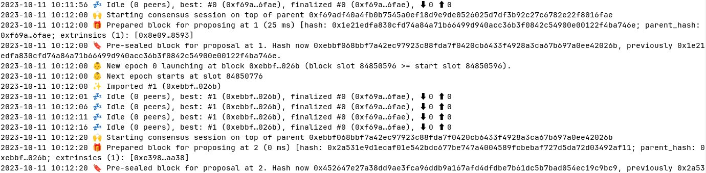

<div align="Center">
<h1>Avail Node</h1>
<h3>Official Client for the Avail blockchain</h3>
</div>

<br>

[](https://github.com/availproject/avail/actions/workflows/default.yml)




## Running Avail Node
### Manually

> To manually run the Avail Node, you'll need to have the following dependencies installed:
> - [Rust](https://www.rust-lang.org/learn/get-started)
> - [Substrate dependencies](https://docs.substrate.io/install/)


After ensuring you have the dependencies installed, you can run the Avail Node using the following command:
```bash
mkdir -p output
cargo run --locked --release -- --chain goldberg -d ./output
```
This command compiles and runs the Avail Node connected to the Goldberg Network.

```
2023-11-17 11:31:35 Avail Node    
2023-11-17 11:31:35 ✌️  version 1.8.2-3fe1bd1a835    
2023-11-17 11:31:35 ❤️  by Anonymous, 2017-2023    
2023-11-17 11:31:35 📋 Chain specification: Avail Goldberg Testnet    
2023-11-17 11:31:35 🏷  Node name: exotic-shame-9524    
2023-11-17 11:31:35 👤 Role: FULL    
2023-11-17 11:31:35 💾 Database: RocksDb at /tmp/substrate6VCSz0/chains/avail_goldberg_testnet/db/full    
2023-11-17 11:31:36 🔨 Initializing Genesis block/state (state: 0x6bc7…ec83, header-hash: 0x6f09…a7ae)    
2023-11-17 11:31:36 👴 Loading GRANDPA authority set from genesis on what appears to be first startup.    
2023-11-17 11:31:36 👶 Creating empty BABE epoch changes on what appears to be first startup.    
2023-11-17 11:31:36 🏷  Local node identity is: 12D3KooWGhdJUhZTtqByZKpojSdT26eadVtnvQ6fdrJU8mjeTuiq    
2023-11-17 11:31:36 Prometheus metrics extended with avail metrics    
2023-11-17 11:31:36 💻 Operating system: linux    
2023-11-17 11:31:36 💻 CPU architecture: x86_64    
2023-11-17 11:31:36 💻 Target environment: gnu    
2023-11-17 11:31:36 💻 CPU: 13th Gen Intel(R) Core(TM) i7-13700K    
2023-11-17 11:31:36 💻 CPU cores: 16    
2023-11-17 11:31:36 💻 Memory: 31863MB    
2023-11-17 11:31:36 💻 Kernel: 6.5.10-200.fc38.x86_64    
2023-11-17 11:31:36 💻 Linux distribution: Fedora Linux 38 (Workstation Edition)    
2023-11-17 11:31:36 💻 Virtual machine: no    
2023-11-17 11:31:36 📦 Highest known block at #0    
2023-11-17 11:31:36 〽️ Prometheus exporter started at 127.0.0.1:9615    
2023-11-17 11:31:36 Running JSON-RPC server: addr=127.0.0.1:9944, allowed origins=["http://localhost:*", "http://127.0.0.1:*", "https://localhost:*", "https://127.0.0.1:*", "https://polkadot.js.org"]    
2023-11-17 11:31:36 🏁 CPU score: 1.65 GiBs    
2023-11-17 11:31:36 🏁 Memory score: 22.56 GiBs    
2023-11-17 11:31:36 🏁 Disk score (seq. writes): 7.25 GiBs    
2023-11-17 11:31:36 🏁 Disk score (rand. writes): 2.81 GiBs    
2023-11-17 11:31:37 🔍 Discovered new external address for our node: /ip4/176.61.156.176/tcp/30333/ws/p2p/12D3KooWGhdJUhZTtqByZKpojSdT26eadVtnvQ6fdrJU8mjeTuiq    
2023-11-17 11:31:41 ⚙️  Syncing, target=#41833 (8 peers), best: #2690 (0x13c8…42fa), finalized #2560 (0x1282…a791), ⬇ 2.9MiB/s ⬆ 38.4kiB/s    
2023-11-17 11:31:46 ⚙️  Syncing 62.8 bps, target=#41833 (8 peers), best: #3004 (0xa183…81a0), finalized #2560 (0x1282…a791), ⬇ 106.9kiB/s ⬆ 2.1kiB/s  
```

#### Running Dev Chain
A development chain is typically used for testing and development purposes.
```bash
cargo run --locked --release -- --dev
```

### Docker
To run the Avail Node using Docker, follow these steps:

```bash
# Build the Docker image for the Avail Node:
docker build -t availnode -f ./dockerfiles/avail-node.Dockerfile .

# Create an output directory. Here the node's data will be stored.
mkdir output

# Run the Avail Node container:
docker run --rm -p 30333:30333 -p 9944:9944 -v ./output:/output availnode
# For SELinux
docker run --rm -p 30333:30333 -p 9944:9944 -v ./output:/output:z availnode
```

#### Running Dev Chain
There are instructions for running a development chain using Docker. A development chain is typically used for testing and development purposes.

```bash
# Build the Docker image for the Avail Node:
docker build -t availnode -f ./dockerfiles/avail-node.Dockerfile .

# Create an output directory. Here the node's data will be stored.
mkdir output

# Run the Avail Node container:
docker run --rm -p 30333:30333 -p 9944:9944 -v ./output:/output availnode --dev --rpc-methods=unsafe --unsafe-rpc-external --rpc-cors=all
# For SELinux
docker run --rm -p 30333:30333 -p 9944:9944 -v ./output:/output:z availnode --dev --rpc-methods=unsafe --unsafe-rpc-external --rpc-cors=all
```

### Podman
To run the Avail Node using Docker, follow these steps:

```bash
# Build the Docker image for the Avail Node:
podman build -t availnode -f ./dockerfiles/avail-node.Dockerfile .

# Create an output directory. Here the node's data will be stored.
mkdir output

# Run the Avail Node container:
podman run --rm -p 30333:30333 -p 9944:9944 -v ./output:/output availnode
# For SELinux
podman run --rm -p 30333:30333 -p 9944:9944 -v ./output:/output:z availnode
```

#### Running Dev Chain
There are instructions for running a development chain using Podman. A development chain is typically used for testing and development purposes.

```bash
# Build the Docker image for the Avail Node:
podman build -t availnode -f ./dockerfiles/avail-node.Dockerfile .

# Create an output directory. Here the node's data will be stored.
mkdir output

# Run the Avail Node container:
podman run --rm -p 30333:30333 -p 9944:9944 -v ./output:/output availnode --dev --rpc-methods=unsafe --unsafe-rpc-external --rpc-cors=all
# For SELinux
podman run --rm -p 30333:30333 -p 9944:9944 -v ./output:/output:z availnode --dev --rpc-methods=unsafe --unsafe-rpc-external --rpc-cors=all
```

## Run Benchmarks
### Kate RPC
```bash
cargo build --release --features kate-rpc-metrics
deno run -A ./examples/deno/benchmarks/query_proof.ts && deno run -A ./examples/deno/benchmarks/query_data_proof.ts && deno run -A ./examples/deno/benchmarks/query_rows.ts && deno run -A ./examples/deno/benchmarks/query_block_length.ts && deno run -A ./examples/deno/benchmarks/query_app_data.ts
```

### Header Builder
```bash
# Option 1: for time measurement 
cargo bench --bench header_kate_commitment_cri
# Option 2: for time measurement 
cargo bench --bench header_kate_commitment_divan
# Option 1: for instructions, cache and main memory hits
cargo bench --bench header_kate_commitment_iai_callgrind
# Option 2: for instructions, cache and main memory hits
cargo bench --bench header_kate_commitment_iai
```

## Additional Documentation
For additional documentation check our [wiki page](https://github.com/availproject/avail/wiki).
There you can learn how to:
- Run Avail Node together with Avail Light Clients
- Build Avail Node for different Linux flavours
- Find out what node synchronization options are available
- Running Avail Benchmarks


## Interract with the chain
You can find on this repository many example on how to interract with any avail chain.
- In the avail-js folder, you will find our wrapper for polkadot js including multiple helpers.
    - The example folder contains some examples using node-js and an example web app to setup the extension.
- In the avail-subxt folder, you will find our fork of subxt with some example on usage.
- In the examples folders you will find examples for:
  - Deno examples
  - Go examples
  - Validitum example implementation 